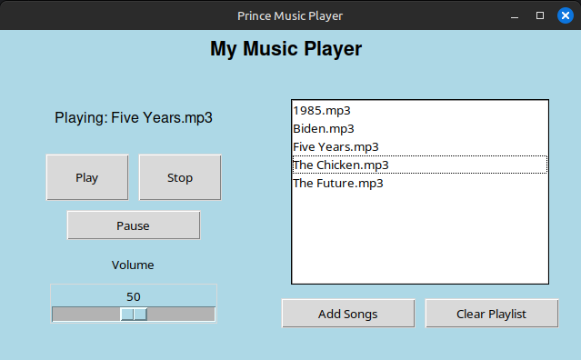

# Music Player

This is a **Music Player** application built using **Python** and **Tkinter**. It allows users to play songs from a playlist, control playback (play, pause, stop), adjust volume, and manage the playlist.



## Features
- 🎵 **Play, Pause, Stop** songs from your playlist.
- 🔊 **Volume Control** with a slider to adjust sound level.
- 📜 **Playlist Management**: Add, clear, and save the playlist.
- 🧑‍🤝‍🧑 **User-friendly Interface** with an easy-to-use design.

## Requirements
Make sure you have the following dependencies installed:
- Python 3.x
- `tkinter` (usually comes with Python)
- `pygame` (for playing audio)

To install `pygame`, run:
```bash
pip install pygame
